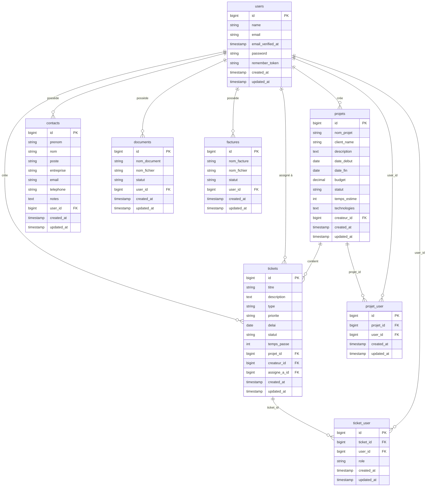

# 🎫 ESN Ticketing — Application de gestion de tickets


Application web de **gestion de ticketing** pour une ESN. Elle centralise le suivi des demandes clients, la gestion de projets, le suivi du temps et la facturation, dans une interface moderne en dark theme.

> Projet académique — Fil rouge ESIEA 3A Développement Web

---

## 📋 Table des matières

- [Présentation fonctionnelle](#-présentation-fonctionnelle)
- [Stack technique](#-stack-technique)
- [Prérequis](#-prérequis)
- [Installation](#-installation)
- [Utilisation](#-utilisation)
- [Structure du projet](#-structure-du-projet)
- [Modèles et relations](#-modèles-et-relations)
- [Routes](#-routes)
- [Base de données](#️-base-de-données)
- [Statut des fonctionnalités](#-statut-des-fonctionnalités)
- [Conventions de code](#-conventions-de-code)
- [Contribution](#-contribution)
- [Licence](#-licence)

---

## 🎯 Présentation fonctionnelle

L'application est conçue pour répondre aux besoins d'une ESN qui gère simultanément plusieurs projets clients. Elle offre :

- **Un système de ticketing** : création, suivi, priorisation et résolution de demandes (bugs, features, support)
- **Une gestion de projets** : vue d'ensemble des projets, association de tickets, suivi budgétaire et temporel
- **Un carnet de contacts** : annuaire des interlocuteurs clients rattachés à l'utilisateur
- **Une GED légère** : stockage et suivi de documents liés aux projets
- **Une gestion des factures** : suivi des factures émises et de leur statut
- **Un tableau de bord** : vue synthétique de l'activité de l'utilisateur connecté

### Rôles utilisateurs (en cours d'implémentation)

| Rôle | Description |
|------|-------------|
| **Admin** | Accès complet, gestion des utilisateurs et de la configuration |
| **Utilisateur** | Création et traitement de tickets, gestion de projets |

---

## 🛠️ Stack technique

| Couche | Technologie |
|--------|-------------|
| Backend | PHP 8.2, Laravel 12 |
| Frontend | Blade, CSS custom (dark theme), JavaScript vanilla |
| Authentification | Laravel Breeze |
| Base de données | SQLite (dev), MySQL/MariaDB (prod) |
| Build | Vite, NPM |
| Qualité | Laravel Pint (PSR-12), PHPUnit 11 |
| Dev tools | Laravel Sail, Laravel Pail, Composer |

---

## 📦 Prérequis

- **PHP** 8.2 ou supérieur (avec extensions : `pdo_sqlite`, `mbstring`, `xml`, `curl`)
- **Composer** 2.x
- **Node.js** 18 ou supérieur
- **NPM** 9 ou supérieur
- **Git**

---

## 🚀 Installation

### Installation rapide (recommandée)

Le projet expose un script `composer run setup` qui automatise toutes les étapes :

```bash
git clone <url-du-repo> esn-ticketing
cd esn-ticketing
composer run setup
```

Ce script exécute dans l'ordre :
1. `composer install` — dépendances PHP
2. Copie de `.env.example` → `.env` (si absent)
3. `php artisan key:generate` — génération de la clé d'application
4. `php artisan migrate --force` — création des tables
5. `npm install` — dépendances front-end
6. `npm run build` — compilation des assets

### Installation manuelle (pas à pas)

```bash
# 1. Cloner le dépôt
git clone <url-du-repo> esn-ticketing
cd esn-ticketing

# 2. Installer les dépendances PHP
composer install

# 3. Configurer l'environnement
cp .env.example .env
php artisan key:generate
```

Éditer `.env` selon votre environnement :

```dotenv
APP_NAME="ESN Ticketing"
APP_URL=http://localhost:8000

# SQLite (développement — défaut)
DB_CONNECTION=sqlite
# DB_DATABASE=/chemin/absolu/vers/database/database.sqlite

# MySQL (production)
# DB_CONNECTION=mysql
# DB_HOST=127.0.0.1
# DB_PORT=3306
# DB_DATABASE=esn_ticketing
# DB_USERNAME=root
# DB_PASSWORD=secret
```

```bash
# 4. Créer le fichier SQLite (si non existant)
touch database/database.sqlite

# 5. Lancer les migrations
php artisan migrate

# 6. (Optionnel) Peupler la base avec des données de test
php artisan db:seed

# 7. Installer les dépendances front-end et compiler
npm install
npm run build

# 8. Démarrer le serveur de développement
php artisan serve
```

L'application est accessible sur [http://localhost:8000](http://localhost:8000).

### Développement (hot reload)

```bash
composer run dev
```

Lance en parallèle : serveur PHP, queue worker, Pail (logs) et Vite (HMR).

---

## 🖥️ Utilisation

```bash
# Lancer les tests
composer run test

# Formater le code (Laravel Pint)
./vendor/bin/pint

# Vider les caches
php artisan cache:clear
php artisan config:clear
php artisan view:clear

# Accéder à Tinker (REPL)
php artisan tinker
```

---

## 📁 Structure du projet

```
.
├── app/
│   ├── Http/
│   │   └── Controllers/
│   │       ├── Auth/                    # Controllers Breeze (login, register, reset…)
│   │       ├── DashboardController.php  # Tableau de bord
│   │       ├── TicketController.php     # CRUD complet des tickets
│   │       ├── ProjectController.php    # CRUD complet des projets
│   │       ├── ContactController.php    # CRUD des contacts
│   │       ├── DocumentController.php   # Gestion des documents
│   │       ├── FactureController.php    # Gestion des factures
│   │       └── ProfileController.php   # Profil utilisateur (Breeze)
│   └── Models/
│       ├── User.php        # Utilisateur — pivot central des relations
│       ├── Ticket.php      # Ticket de demande
│       ├── Projet.php      # Projet (table `projets`)
│       ├── Contact.php     # Contact client
│       ├── Document.php    # Document GED
│       └── Facture.php     # Facture
│
├── database/
│   ├── migrations/         # Toutes les migrations (versionnées)
│   ├── factories/          # Factories pour les tests
│   └── seeders/            # Données de démonstration
│
├── resources/
│   └── views/
│       ├── layouts/        # Layout principal + navigation (Breeze)
│       ├── auth/           # Vues d'authentification (Breeze)
│       ├── dashboard.blade.php
│       └── pages/user/
│           ├── partials/   # head.blade.php, header.blade.php
│           ├── tickets.blade.php          # Liste des tickets
│           ├── create_tickets.blade.php   # Formulaire création ticket
│           ├── modif_tickets.blade.php    # Formulaire édition ticket
│           ├── ticket_detail.blade.php    # Détail d'un ticket
│           ├── project.blade.php          # Liste des projets
│           ├── create_new_project.blade.php
│           ├── details_project.blade.php
│           ├── modif_project.blade.php
│           ├── contacts.blade.php
│           ├── new_contacts.blade.php
│           ├── modif_contacts.blade.php
│           ├── documents.blade.php
│           ├── bills.blade.php
│           └── settings.blade.php
│
├── routes/
│   ├── web.php             # Routes de l'application (protégées par auth)
│   └── auth.php            # Routes Breeze (login, register, reset…)
│
├── public/
│   └── styles.css          # CSS global — dark theme, composants UI
│
├── docs/
│   └── schema.md           # Schéma Mermaid de la base de données
│
├── .env.example
├── composer.json
├── vite.config.js
└── README.md
```

---

## 🔗 Modèles et relations

### `User`
- `hasMany(Ticket, 'createur_id')` → tickets créés
- `belongsToMany(Ticket, 'ticket_user')` → tickets où l'utilisateur est membre (avec pivot `role`)
- `hasMany(Projet, 'createur_id')` → projets créés
- `belongsToMany(Projet, 'projet_user')` → projets en collaboration
- `hasMany(Contact)` → contacts personnels

### `Ticket`
- `belongsTo(User, 'createur_id')` → créateur
- `belongsTo(User, 'assigne_a_id')` → assigné à
- `belongsTo(Projet, 'projet_id')` → projet associé (nullable)
- `belongsToMany(User, 'ticket_user')` → membres de l'équipe (avec pivot `role`)

### `Projet` (table `projets`)
- `belongsTo(User, 'createur_id')` → créateur
- `belongsToMany(User, 'projet_user')` → collaborateurs
- `hasMany(Ticket)` → tickets du projet

### `Contact`
- `belongsTo(User)` → appartient à un utilisateur

### `Document` / `Facture`
- `belongsTo(User)` → appartiennent à un utilisateur

---

## 🛣️ Routes

### Publiques

| Méthode | URL | Description |
|---------|-----|-------------|
| `GET` | `/` | Page d'accueil |

### Authentification (Laravel Breeze — `routes/auth.php`)

| Méthode | URL | Description |
|---------|-----|-------------|
| `GET` | `/login` | Formulaire de connexion |
| `POST` | `/login` | Traitement connexion |
| `POST` | `/logout` | Déconnexion |
| `GET` | `/register` | Formulaire d'inscription |
| `POST` | `/register` | Traitement inscription |
| `GET` | `/forgot-password` | Formulaire mot de passe oublié |
| `POST` | `/forgot-password` | Envoi du lien de réinitialisation |
| `GET` | `/reset-password/{token}` | Formulaire nouveau mot de passe |
| `POST` | `/reset-password` | Traitement réinitialisation |
| `GET` | `/verify-email` | Page de vérification email |

### Application (middleware `auth`)

#### Dashboard & Profil

| Méthode | URL | Description |
|---------|-----|-------------|
| `GET` | `/dashboard` | Tableau de bord |
| `GET` | `/profile` | Édition du profil |
| `PATCH` | `/profile` | Mise à jour du profil |
| `DELETE` | `/profile` | Suppression du compte |
| `GET` | `/settings` | Paramètres de l'application |

#### Tickets

| Méthode | URL | Description |
|---------|-----|-------------|
| `GET` | `/tickets` | Liste des tickets de l'utilisateur |
| `GET` | `/create-tickets` | Formulaire de création |
| `POST` | `/tickets` | Enregistrement d'un ticket |
| `GET` | `/tickets/{ticket}` | Détail d'un ticket |
| `GET` | `/tickets/{ticket}/edit` | Formulaire d'édition |
| `PUT` | `/tickets/{ticket}` | Mise à jour d'un ticket |
| `DELETE` | `/tickets/{ticket}` | Suppression d'un ticket |
| `POST` | `/tickets/{ticket}/add-time` | Ajout de temps passé |

#### Projets

| Méthode | URL | Description |
|---------|-----|-------------|
| `GET` | `/project` | Liste des projets |
| `GET` | `/project/create` | Formulaire de création |
| `POST` | `/project` | Enregistrement d'un projet |
| `GET` | `/project/{id}` | Détail d'un projet |
| `GET` | `/project/{id}/edit` | Formulaire d'édition |
| `PUT` | `/project/{id}` | Mise à jour d'un projet |
| `DELETE` | `/project/{id}` | Suppression d'un projet |
| `POST` | `/project/{id}/link-ticket` | Associer un ticket à un projet |

#### Contacts

| Méthode | URL | Description |
|---------|-----|-------------|
| `GET` | `/contacts` | Liste des contacts |
| `GET` | `/contacts/create` | Formulaire de création |
| `POST` | `/contacts` | Enregistrement d'un contact |
| `GET` | `/contacts/{contact}/edit` | Formulaire d'édition |
| `PUT` | `/contacts/{contact}` | Mise à jour d'un contact |
| `DELETE` | `/contacts/{contact}` | Suppression d'un contact |

#### Documents

| Méthode | URL | Description |
|---------|-----|-------------|
| `GET` | `/documents` | Liste des documents |
| `GET` | `/documents/create` | Formulaire d'ajout |
| `POST` | `/documents` | Enregistrement d'un document |
| `GET` | `/documents/{document}/edit` | Formulaire d'édition |
| `PUT` | `/documents/{document}` | Mise à jour d'un document |
| `GET` | `/documents/{document}/download` | Téléchargement |
| `DELETE` | `/documents/{document}` | Suppression |

#### Factures

| Méthode | URL | Description |
|---------|-----|-------------|
| `GET` | `/bills` | Liste des factures |
| `GET` | `/factures/create` | Formulaire de création |
| `POST` | `/factures` | Enregistrement d'une facture |
| `GET` | `/factures/{facture}/edit` | Formulaire d'édition |
| `PUT` | `/factures/{facture}` | Mise à jour d'une facture |
| `GET` | `/factures/{facture}/download` | Téléchargement |
| `DELETE` | `/factures/{facture}` | Suppression |

---

## 🗄️ Base de données

Le schéma complet avec les types détaillés est disponible dans [`docs/schema.md`](docs/schema.md).



---

## ✅ Statut des fonctionnalités

| Fonctionnalité | Statut |
|----------------|--------|
| Authentification (inscription, connexion, logout) | ✅ Implémenté |
| Réinitialisation du mot de passe | ✅ Implémenté |
| Vérification d'email | ✅ Implémenté |
| CRUD Tickets complet | ✅ Implémenté |
| Suivi du temps par ticket (`add-time`) | ✅ Implémenté |
| Permissions sur les tickets (`estVisible`, `peutModifier`) | ✅ Implémenté |
| CRUD Projets complet | ✅ Implémenté |
| Association ticket ↔ projet | ✅ Implémenté |
| CRUD Contacts | ✅ Implémenté |
| CRUD Documents (upload/download) | ✅ Implémenté |
| CRUD Factures (upload/download) | ✅ Implémenté |
| Tableau de bord | ✅ Implémenté |
| Dark theme CSS | ✅ Implémenté |
| Tables pivot `projet_user` / `ticket_user` | ✅ Implémenté |
| Système de rôles (Admin / Collaborateur / Client) | 🚧 En cours |
| Gestion des contrats et enveloppes d'heures | 🚧 En cours |
| Validation client des tickets facturables | 📋 Prévu |
| API REST | 📋 Prévu |
| Notifications (email, in-app) | 📋 Prévu |
| Tests unitaires et fonctionnels | 📋 Prévu |
| Export PDF des factures | 📋 Prévu |

---

## 📐 Conventions de code

### PHP / Laravel

- Autoloading **PSR-4** via Composer (`App\` → `app/`)
- Formatage **PSR-12** enforced par [Laravel Pint](https://laravel.com/docs/pint)
- Conventions Laravel : nommage des controllers en `PascalCase`, routes en `kebab-case`, noms de vues en `snake_case`
- Les méthodes de controller suivent les conventions RESTful : `index`, `create`, `store`, `show`, `edit`, `update`, `destroy`

### Nommage des colonnes

Les colonnes métier sont nommées en **français** (fil rouge académique) :

| Colonne | Description |
|---------|-------------|
| `nom_projet`, `titre` | Libellés |
| `createur_id` | FK vers l'auteur de la ressource |
| `assigne_a_id` | FK vers l'utilisateur assigné |
| `temps_passe`, `temps_estime` | Durées en minutes/heures |
| `priorite`, `statut` | Énumérations métier |
| `date_debut`, `date_fin` | Dates métier |

### Base de données

- Les noms de tables suivent les conventions Laravel (pluriel) **sauf `projets`** (table nommée explicitement via `protected $table = 'projets'` dans le modèle)
- Les clés étrangères utilisent le pattern `{nom_logique}_id`

---

## 🤝 Contribution

Ce projet est développé dans le cadre d'un **TP académique** (fil rouge ESIEA 3A Développement Web).

Pour contribuer :

```bash
# 1. Créer une branche feature
git checkout -b feature/nom-de-la-feature

# 2. Développer et formater
./vendor/bin/pint

# 3. Lancer les tests
composer run test

# 4. Commiter avec un message clair
git commit -m "feat: description de la fonctionnalité"

# 5. Ouvrir une Pull Request
```
