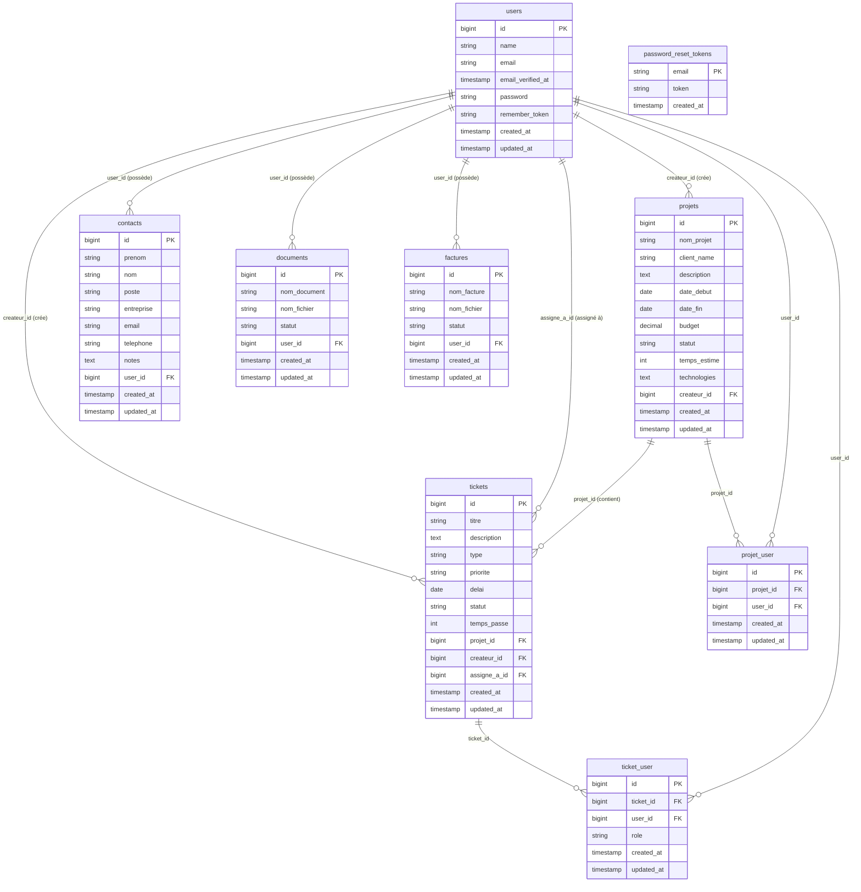

# 🗄️ Schéma de la base de données

Diagramme entité-relation de l'application de ticketing.

## Légende

| Symbole | Signification |
|---------|---------------|
| `PK`    | Clé primaire |
| `FK`    | Clé étrangère |
| `\|\|--o{` | Un à plusieurs (one-to-many) |

## Tables pivot

- **`projet_user`** — Relie les utilisateurs aux projets (collaborateurs). Permet les relations many-to-many entre `users` et `projets`.
- **`ticket_user`** — Relie les utilisateurs aux tickets avec un rôle (`lecteur` / `editeur`). Permet les relations many-to-many entre `users` et `tickets`.

## Valeurs énumérées

| Table | Colonne | Valeurs possibles | Défaut |
|-------|---------|-------------------|--------|
| `projets` | `statut` | `nouveau`, `en cours`, `terminé`, `archivé` | `nouveau` |
| `tickets` | `type` | `bug`, `feature`, `support` | `bug` |
| `tickets` | `priorite` | `low`, `medium`, `high`, `critical` | `medium` |
| `tickets` | `statut` | `Nouveau`, `En cours`, `Résolu`, `Fermé` | `Nouveau` |
| `ticket_user` | `role` | `lecteur`, `editeur` | `lecteur` |
| `documents` | `statut` | `en cours`, `validé`, `archivé` | `en cours` |
| `factures` | `statut` | `en cours`, `payée`, `en retard` | `en cours` |
